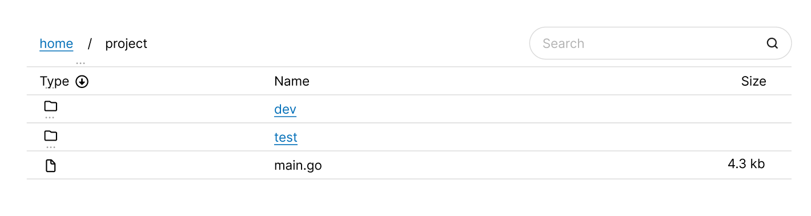

# RFD 1 - Directory Browser

## UI

See main application page in [Wireframes](#wireframes), the login page will be a simple centered card with input fields for password and username as well as a submit button.

### Wireframes



(ignore the dots above each of the icons)

### Reusable components

* TableRow
    * clickable name if directory
    * icon indicating type file or directory
        * Page indicates file
        * folder indicates directory
    * size in largest unit for that file 
        * rounded up to nearest tenth of unit unless its bytes which will be whole numbers only

* BreadCrumbs
    * each bread crumb clickable to navigate to that directory except current directory
    * / after each crumb
    * Possibly separate out into 2 components, BreadCrumb and BreadCrumbs
        * Probably use the breadcrumb component as clickable directory name in the table as well

* Search bar
    * Takes function to act on input into search bar
        * may want to include some kind of debouncing to make it less jerky
    * May want to think about saving filters and sorting into local storage

### Site url paths

* https://\<site-root>/\<path>/\<to>/\<directory>

## API

* GET /api/files/\<path>/\<to>/\<directory>
    * Responses
        * 200
            ```json
            {
                "name": "project",
                "type": "directory",
                "size": 0,
                "contents": [
                    {
                        "name": "main.go",
                        "type": "file",
                        "size": 4299
                    },
                    {
                        "name": "dev",
                        "type": "directory",
                        "size": 0
                    },
                    {
                        "name": "test",
                        "type": "directory",
                        "size": 0
                    }
                ]
            }
            ```
        * 404
        * 401

* POST /api/login
    * Payload
        ```json
        {
            "username": "<username>",
            "password": "<password>"
        }
        ```
    * Responses
        * 200 
        * 401

* POST /api/logout
    * Responses
        * 200


## Security

### Authentication

The main idea will be to create a session token after logging in and setting the expiration to 10 min into the future. On subsequent requests the expiration will be updated up to a maximum of 8 hours after the original login. The session token will be http only and secure so it will only be manipulated server side and only be transported over https. Samesite will be set to strict to restrict cookies being sent in requests originating from the origin site. After a logout or max expiration the session token will be destroyed which will force the user to reauthenticate. 

#### Session Management

* Creation
    * On login user will input his credentials, a request will be made to the login endpoint which will hash the input password using Argon2I and compare it to the existing hashed password for the username given. If the password hash matches create a session token via a random number generator. Create a cookie with the name `session` set to the session token value and add it to the response. Store the session token in a map, session token -> { userid, inactivityExpiration, maxExpiration }
        * Possible Enhancements
            * could sign cookie
                * probably not needed due to the cookie only holding the session id so there really isn't anything to tamper with
                * this would make it so in the future if there were roles associated with the cookie it could be determined if the someone tried to escalate their privileges 

* Invalidation
    * On logout or after the session has expired either via the inactivityExpiration or maxExpiration the session will be deleted. For the non logout scenario the expiration and max age will be checked on each request which will dictate when the session is actually deleted.

### TLS

* Certificate
    * For dev this will just be a self signed cert using openssl
    * If this were to be deployed it would require a cert from a certificate authority how this is done is dependent on how it is deployed.

* Redirect
    * All requests made through http will be redirected via a 301 redirect to the requested page over https. Another option would be to disable listening to http requests on port 80 but this could lead to a poor user experience if a user were to use http. 

* HSTS header
    * All requests will get the HSTS header with max age set at 2 years so the browser will only access the site through https after the first request. If this site were to have subdomains it would be prudent to set include subdomains on the header but as that is not the case it will be omitted. Preload might also be worthwhile to set in a production environment.

* Version
    * minimum accepted will be 1.3
    * this might exclude some older clients from being able to use the site but will be a higher security posture

### Concerns

* Credential Stuffing/Brute forcing
    * This might be outside of the scope of this particular project 
    * Mitigations:
        * rate limiting based on IP for the login endpoint 
        * failed login counts

* Path Traversal
    * Mitigations:
        * input validation
            * whitelist well formed file paths
            
* Unix vs Windows file system issues
    * probably outside the scope of this exercise but worth calling out
    * I am going to assume unix based file systems for deployment

* XSS attack
    * This is largely mitigated by the design of this application in that there is no user input that will be saved and displayed back

* CSRF attack
    * Mitigations:
        * csrf tokens
            * generate xsrf token and place in cookie when being directed to login
            * frontend adds the token to a custom header which is then verified server side during authentication

## Testing

* Mainly unit tests
* nice to haves would be for some integration and a single e2e that logins in, navigates a little and logs out